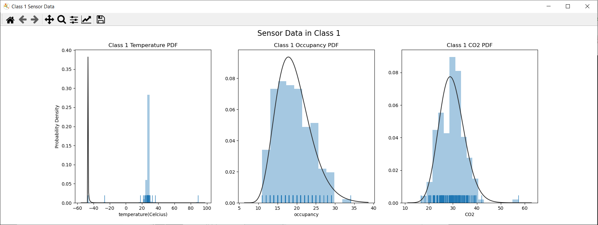
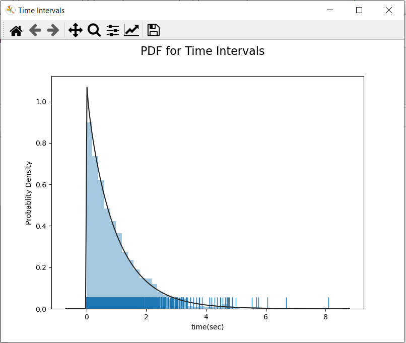
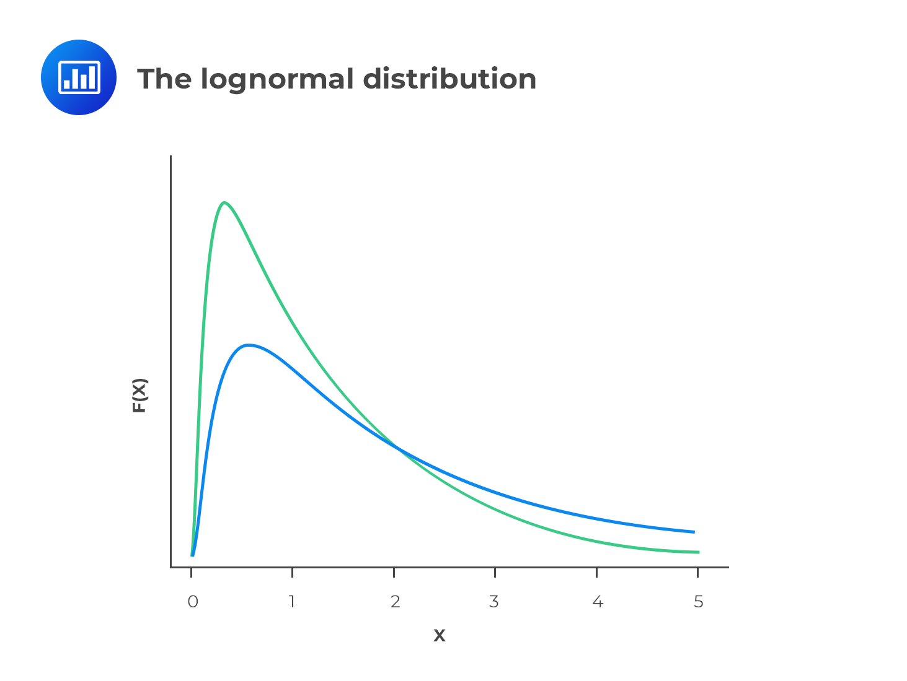
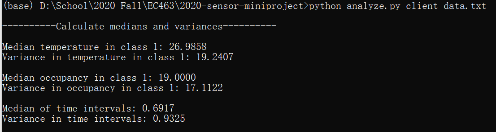
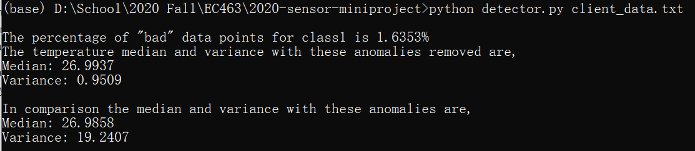

# MiniProject – Sensor Simulation
Authors: Ivan Barcenes, Yuting Chen

2020-09-17

## Task 0: Setup Python Websockets
After running the Python code on our computers, the greeting string issued by the server to the client upon first connecting is 
```sh
ECE Senior Capstone IoT simulator
```
<p align="center">
  
</p><br><br>

## Task 1: Data Flow
Python code was added to the websocket client that saves JSON data to a text file as it comes in message by message. The name of this file is "client_data.txt". This file was added to the repo.
<br><br>

## Task 2: Analysis
Now we have all sensor data in "client_data.txt". We then analyze the temperature and occupancy data in class 1 by using Pandas. Then we use seaborn to plot the probability density function for the three sensors in class1.
```sh
----------Calculate medians and variances----------

Median temperature in class 1: 26.9858
Variance in temperature in class 1: 19.2407

Median occupancy in class 1: 19.0000
Variance in occupancy in class 1: 17.1122
```
<p align="center">
  
</p>
After that, we calculate the median and variance of time intervals of all sensor readings. Here we use Numpy, as the time index array is a ndarray. We then use seaborn to plot the probability density function. 

```sh
Median of time intervals: 0.6917
Variance in time intervals: 0.9325
```
<p align="center">
  
</p> 
The probability density function of time intervals mimics log-normal distribution. Log-normal distribution is a continuous probability distribution of a random variable whose logarithm is normally distributed. It is often used when modeling stock prices and semiconductor lifetime. 
<p align="center">
  
  
</p><br><br>


## Task 3: Design
An algorithm was made using python code which which detects anomalies in tbe tempeture data from class1, and then prints out the percent of bad data. The code then deletes the bad data and prints the median and variance before and after the anomalies were removed.
```sh
The percentage of "bad" data points for class1 is 1.6353%
The temperature median and variance with these anomalies removed are,
Median: 26.9937
Variance: 0.9509

In comparison the median and variance with these anomalies are,
Median: 26.9858
Variance: 19.2407
``` 
Analyzing the data in the text file generated in Task 1 we see that when an anomally occurs the subsqequent sensor readings are reasonable. If this this simulation where a real sensor, however I think this data would indicate a failed sensor since the data at times comes in within seconds of each other so I would not expext the temperature of a classroom to fluctuate as much as it does. While there are relatively few anomalies, the data does fluctuate about the median, usually by about 5 degrees give or take.
<br><br>
There are three different room types for data is collected and they are "class1", "lab1", and office. Under the assumption that the temperature data is read in degrees celcius, I would say that reasonable bounds for temperature readings of each room are:        
- **Class1**: 15-30 degrees celcius     ---    This a typical range of temperatures which could be in a classroom, depending on seasonal weather.   
- **Lab1**: 15-25 degrees celcius       ---    The temperature  is typical for a lab, with less room for fluctuation for tempetaure sensitive lab work.   
- **Office**: 15-30 degrees celcius     ---    Like the class, this is typical range of an office with depending on the seasonal weather.

<p align="center">
  
</p><br><br>

## Task 4: Conclusions
1. This simulation is reflective of the real-world because many sensors use websocket comunication to relay data. In many cases this data is saved and analyzed and checked for anomalies. Sensors are not perfect, so there will be variability in sensor readings like in this simulation.<br><br>
2. This simulation is defficient in that some of the data is not realistic, as the data for temperature, occupancy, and co2 fluctuates significantly in a short period of time. Realistically a sensore will sends information less frequently, and ideally without as much fluctuation. Another area in which the simulation is defiecient is that there is a high level in precision in the temperature and co2 data. Being that the data fluctuates the data is probably not that accurate and so the data can be sent with 2 or 3 decimal places. This would improve readability.<br><br>
3. Python websockets library is easier. Python is an intepreted language. Unlike compiled languages like C++, a Python program doesn't need to be converted to a binary executable machine code everytime it runs. Instead, it's compiled into a much simpler form called bytecode and then is executed in a virtual machine. Thus most python codes are shorter than C++ codes to do the same thing. That also applies to websocket libraries. Python's websockets library can send and recieve messages immediately with a uri and await() function. C++'s websocketpp requires a lot more lines to initialize.<br><br>
4. It depends. It's better to have sensors reach out to server only when having data if some sensors are giving data over a long time period. A server may connect to a large number of sensors with different time intervals. It will waste a large amount of energy if the server is asking for data every second while some sensors are giving data every hour. However, if we know the sensors are giving data at a high speed, it is easier for a server to poll the sensors, as it can easily arrange and check the data values from a large number of sensors. In this problem, it's better to have server poll the sensors. 
<br><br>


## References
- [The Lognormal Distribution vs. the Normal Distribution](https://analystprep.com/cfa-level-1-exam/quantitative-methods/lognormal-distribution/)