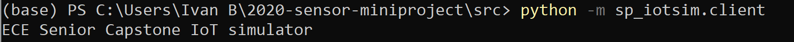
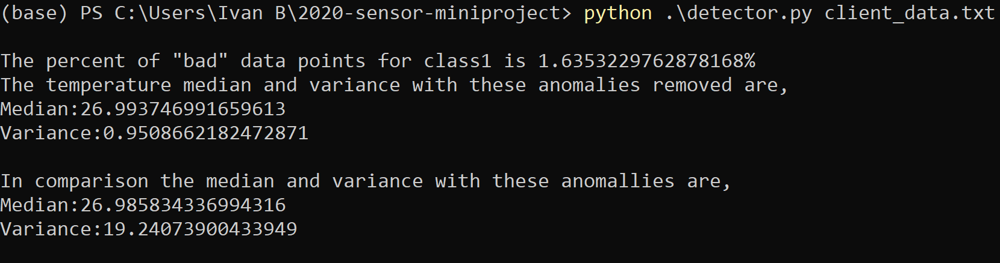

# Task 0
After running the Python code on our computers, the greeting string issued by the server to the client upon first connecting is "ECE Senior Capstone IoT Simulator"

# Task 1
Python code was added to the websocker client that saves JSON data to a text file as it comes in message by message. The name of this file is "client_data.txt". This file was added to the repo.
# Task 2
# Task 3
An algorithm was made using python code which which detects anomalies in tbe tempeture data from class1, and then prints out the percent of bad data. The code then deletes the bad data and prints the median and variance before and after the anomalies were removed.

Analyzing the data in the textfile generated in Task 1 we see that when an anomally occurs the subsqequent sensor readings are reasonable. If this this simulation where a real sensor, however I think this data would indicate a failed sensor since the data at times comes in within seconds of eachother so I would not expext the temperature of a classroom to fluctuate as much as it does. While there are relatively few anomalies, the data does fluctuate about the median by about 5 give or take.

There are three different room types for data is collected and they are "class1", "lab1", and office. Under the assumption that the temperature data is read in degrees celcius, I would say that reasonable bounds for temperature readings of each room are:        
Class1: 15-30 degrees celcius     ---    This a typical range of temperatures which could be in a classroom, depending on seasonal weather.   
Lab1: 15-25 degrees celcius       ---    The temperature  is typical for a lab, with less room for fluctuation for tempetaure sensitive lab work.
Office: 15-30 degrees celcius     ---    Like the class, this is typical range of an office with depending on the seasonal weather.
# Task 4
1. This simulation is reflective of the real-world because many sensors use websocket comunication to relay data. In many cases this data is saved and analyzed and checked for anomalies. Sensors are not perfect, so there will be variability in sensor readings like in this simulation.
2. This simulation is defficient in that some of the data is not realistic, as the data for temperature, occupancy, and co2 fluctuates significantly in a short period of time. Realistically a sensore will sends information less frequently, and ideally without as much fluctuation. Another area in which the simulation is defiecient is that there is a high level in precision in the temperature and co2 data. Being that the data fluctuates the data is probably not that accurate and so the data can be sent with 2 or 3 decimal places. This would improve readability.
